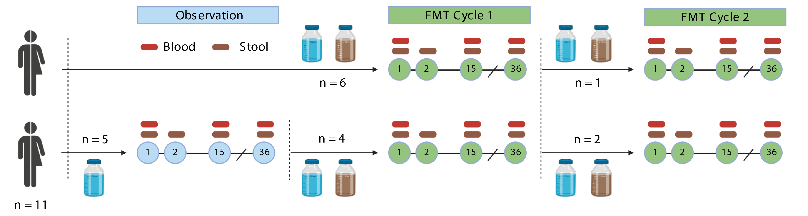

# Background

Fecal microbiota transplantation (FMT) has become an important approach to understand the functions of host-associated microbial communities. In many cases, the taxa in these communities are challenging to culture with routine microbiology methods. Next-generation sequencing approaches have greatly enhanced our ability to identify taxa and their gene-predicted functions associated with responses to treatment with FMT. PREMIX was a randomized, controlled trial of FMT for treatment of multi-drug resistant organism (MDRO) colonization in renal transplant recipients.

This page outlines the naming convention and details of how participants flowed through the PREMIX trial for clarity and analytic context.

---

### 1 - Naming convention

In the PREMIX study, **consented participants** were assigned sequential unique identifiers as **PM--**. Participants were found to not have an MDRO on screening stool culture after consent or were unable to complete a visit cycle as specified in the protocol were not included in analyses or in the publicly available datasets. **Consented stool donors** were similarly assigned sequential unique identifiers as **SD--**, however a single donor was used for all treatments in PREMIX.

**Visits** were conducted in 36-day blocks in one of three visit cycles (i.e. 0, 1, 2). Cycle 0 was an observation visit cycle without administration of FMT. Cycles 1 and 2 were FMT visit cycles. Visits were in person on Days 1, 15, and 36, with an additional stool specimen collected on Day 2. Visits were coded by cycle and day as C-D-- (e.g. C1D36, C0D15).

### 2 - Trial Schema

Participants in the PREMIX study were renal transplant recipients with a history of one of four target multi-drug resistant organism (MDRO) infections. These included: ESBL (extended-spectrum beta-lactamase-producing *Enterobacterales*, defined as any *Enterobacterales* isolate with a Ceftriaxone MIC greater than or equal to 8), CRE (carbapenem-resistant *Enterobacterales*, defined as any *Enterobacterales* isolate that was non-susceptible to any carbapenem, including ertapenem), VRE (vancomycin-resistant *Enterococcus*, defined as any *Enterococcus* isolate that was not susceptible to vancomycin), and MDRP (multi-drug resistant *Pseudomonas*, defined as an isolate resistant to two or more antibiotic classes).

